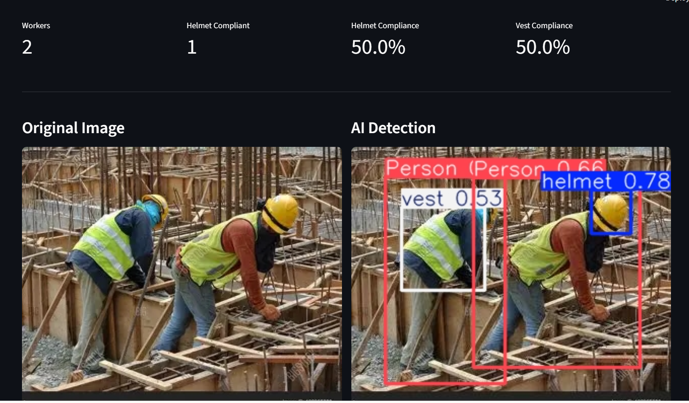
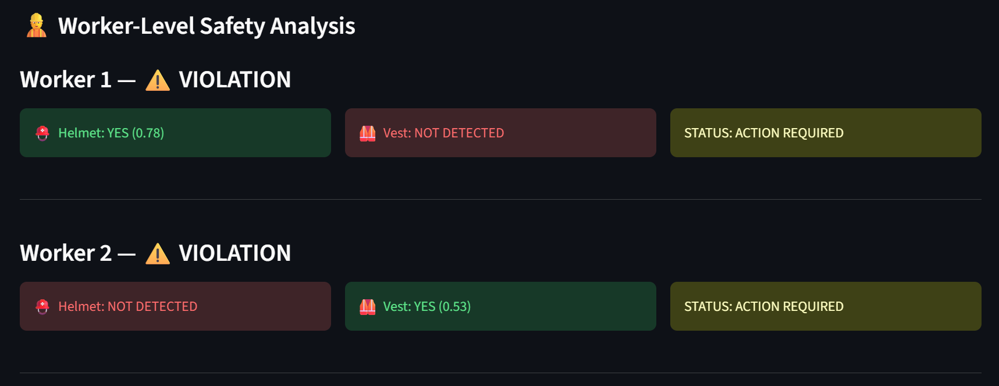
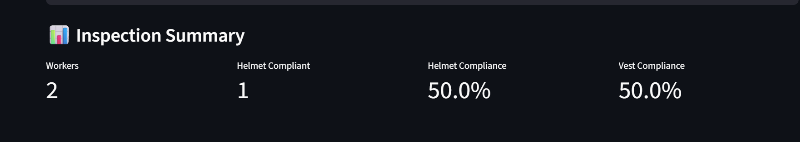
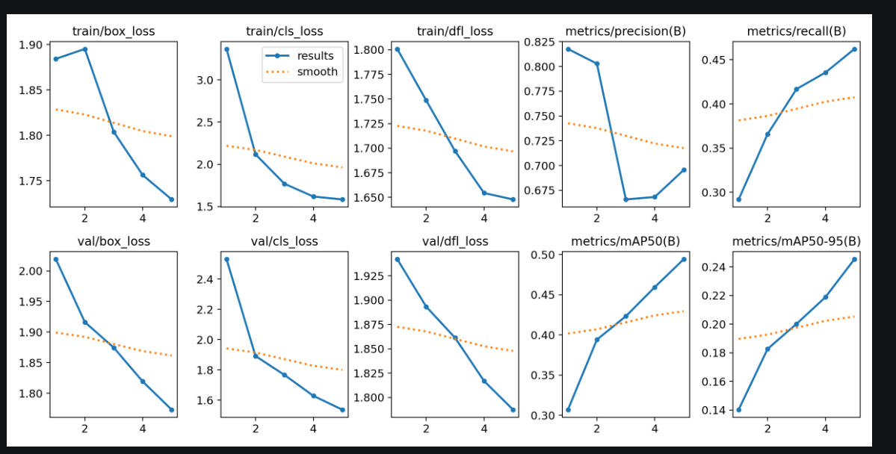
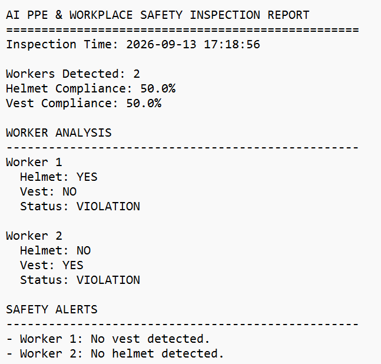

# Industrial Vision AI Inspector

An AI-powered Computer Vision system for detecting PPE compliance and identifying workplace safety violations from construction-site images.

## 🚀 Project Overview

The system uses a custom-trained YOLO11 object detection model to detect workers and PPE such as helmets and safety vests.

It then performs worker-level analysis using bounding-box spatial association and generates safety alerts.

### Pipeline

Image
↓
YOLO11 Object Detection
↓
Worker & PPE Detection
↓
Bounding-Box Spatial Association
↓
Safety Rule Engine
↓
Compliance Analysis
↓
Streamlit Dashboard
↓
Inspection Report

## ✨ Features

- Detect workers using YOLO11
- Detect safety helmets and vests
- Associate PPE with individual workers
- Calculate helmet and vest compliance
- Identify safety violations
- Generate worker-level safety alerts
- Streamlit dashboard
- Downloadable inspection report

## 🛠️ Technologies

- Python
- PyTorch
- Ultralytics YOLO11
- Computer Vision
- Streamlit
- Pillow
- OpenCV
- Pandas

## 🤖 Model Training

The model was trained using the Ultralytics Construction-PPE dataset.

Training configuration:

- Model: YOLO11n
- Epochs: 15
- Image Size: 640
- Batch Size: 8
- Device: CPU

### Validation Results

| Metric | Score |
|---|---:|
| Precision | 0.695 |
| Recall | 0.462 |
| mAP@50 | 0.494 |
| mAP@50-95 | 0.245 |

## 📊 Screenshots

### 1. AI Detection

The system detects workers, helmets and safety vests.



### 2. Worker-Level Safety Analysis

Each detected worker is analyzed individually for PPE compliance.



### 3. Inspection Summary

The dashboard provides overall worker count and PPE compliance metrics.



### 4. Model Training Results

YOLO training and validation metrics across training epochs.



### 5. Inspection Report

The system generates a downloadable inspection report containing worker-level analysis, compliance results, and safety alerts.



## 📁 Project Structure

```text
industrial-vision-inspector/
│
├── data/
│   └── test.jpg
│
├── models/
│   └── best.pt
│
├── screenshots/
│   ├── 01_ai_detection.png
│   ├── 02_worker_safety_analysis.png
│   ├── 03_inspection_summary.png
│   └── 04_training_results.png
│
├── app.py
├── detector.py
├── safety_rules.py
├── requirements.txt
├── README.md
└── .gitignore

⚙️ Installation

Clone the repository:

git clone <YOUR-GITHUB-REPOSITORY-URL>
cd industrial-vision-inspector

Install dependencies:

pip install -r requirements.txt
▶️ Run the Application
streamlit run app.py
The application will open in your browser.

Upload a construction-site image to perform PPE detection and safety analysis.

📄 Inspection Report

The application generates a downloadable inspection report containing:

Inspection time
Number of workers
Helmet compliance
Vest compliance
Worker-level analysis
Safety alerts
⚠️ Limitations

This project is a Computer Vision prototype for portfolio and demonstration purposes.

PPE association is based on bounding-box spatial relationships.
Performance depends on image quality and camera angle.
The dataset does not contain a dedicated no_vest class.
The system should not be treated as a certified industrial safety system.
🔮 Future Improvements
Real-time video detection
Multi-object tracking
Improved PPE association
More safety rules
Hard-hat/vest violation tracking over time
Cloud deployment
Alert notifications
Better model performance with additional training data
👩‍💻 Author

Ramya